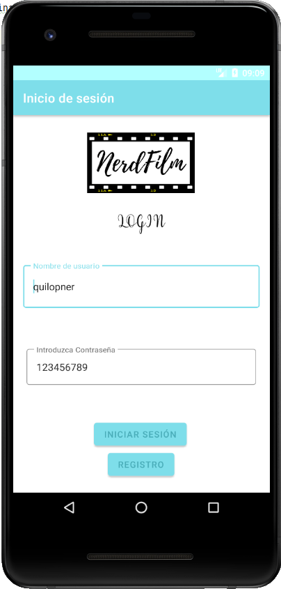
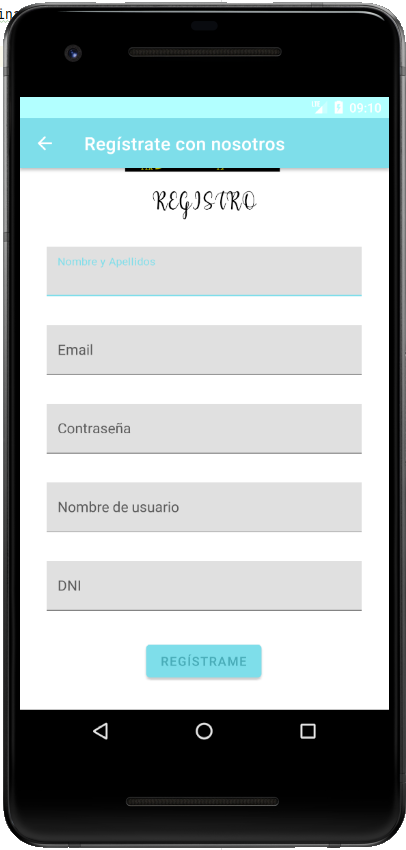
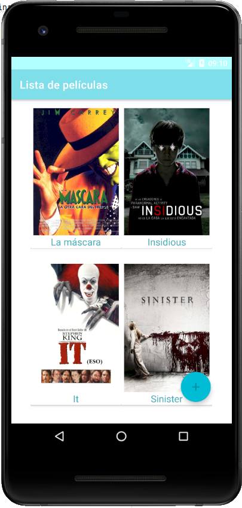
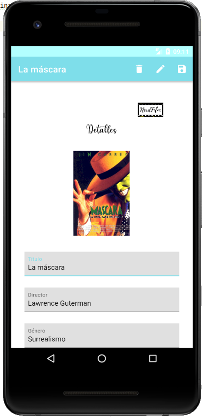

# App Android sobre gestión de películas

En este proyecto se hace un CRUD (creación, lectura, actualización, eliminación) de películas.

### Imagen del inicio de la aplicación

### Imagen del registro de la aplicación

### Imagen del listado de la aplicación

### Imagen de los detalles de la aplicación

#### Listado de películas que se muestran actualmente en la app
- La máscara
- Insidious
- It
- Sinister
- La fiesta de las salchichas
- Los Simpsons

### Cosas pendientes de solucionar
- [ ] Funciones de edición, guardado y borrado
- [ ] Que se oculte el teclado automaticamente cuando abres Registro
- [x] #730
- [x] Modificar el README